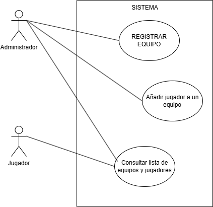
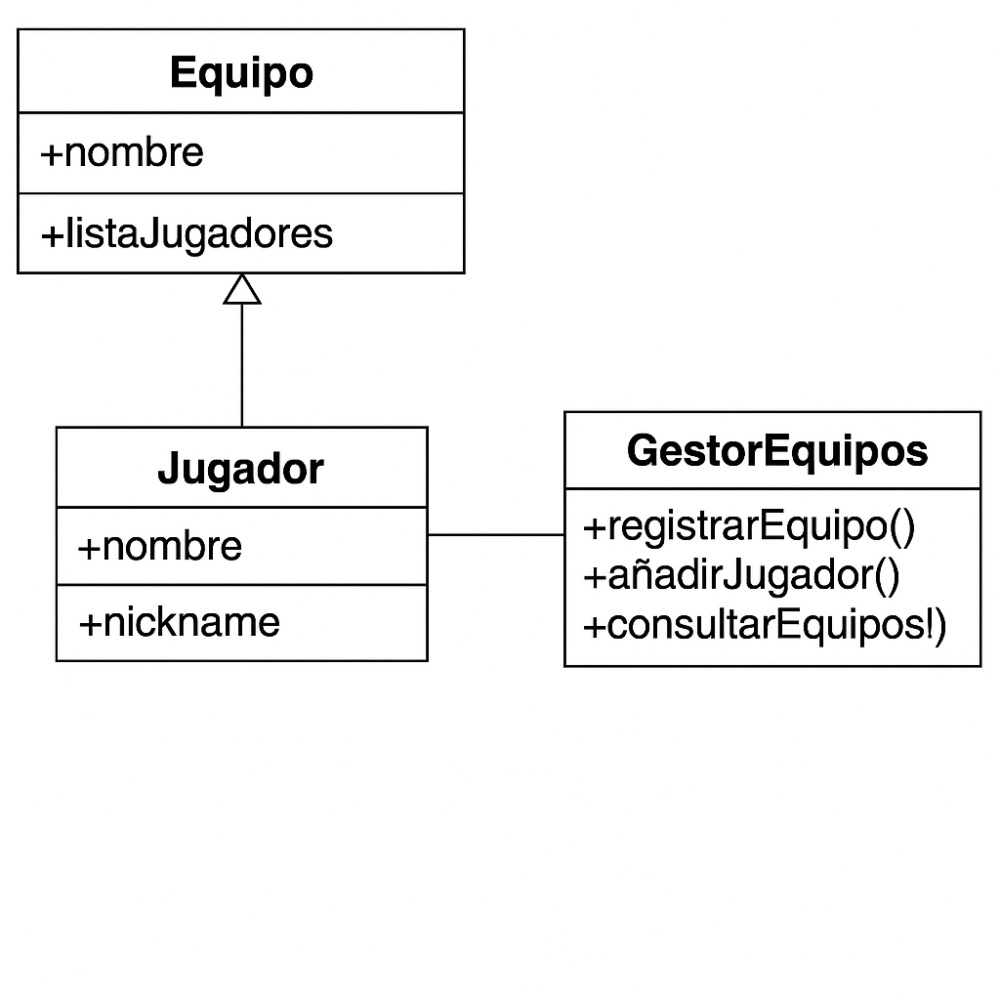

# Sistema de Gestión de Torneos de eSports

Javier Rodríguez Núñez
[\[Tu perfil de GitHub\]](https://github.com/JJRN87)

Este proyecto representa un sistema sencillo para gestionar equipos y jugadores de torneos de eSports, utilizando diagramas UML para definir su estructura.

# Diagramas UML

### Diagrama de Casos de Uso  
Este diagrama muestra las acciones más importantes que puede realizar el administrador del sistema, entre otras cosas puede realizar todas las acciones que 
tiene los distintos actores. Mientras que el jugador puede consultar la lista de equipos y jugadores.
No se otorga más relevancia a los Jugadores, ya que no debería poder añadir, ni registrar equipos.

### Diagrama de Clases  
Aquí se definen las clases principales y cómo se relacionan.  

# Justificación del diseño  
He usado tres clases principales: una para los equipos, otra para los jugadores y otra para gestionar todo. La relación entre ellas es simple, solo lo necesario para cubrir las funciones básicas.

# Conclusiones  
Gracias a esta actividad he aprendido a representar de forma visual las partes más importantes de un sistema usando diagramas UML.
